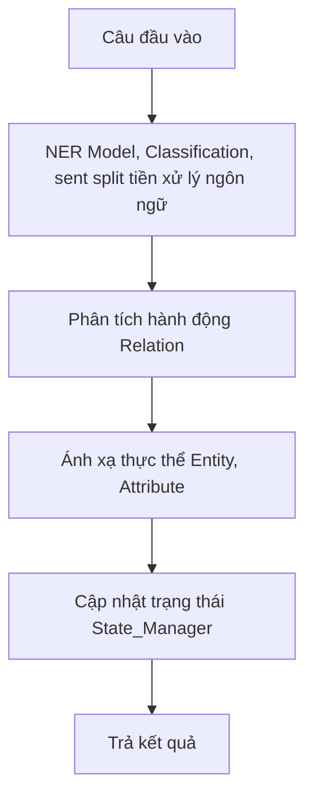

# Chatbot NER Relation System

## Giới thiệu
Hệ thống này là một chatbot xử lý ngôn ngữ tự nhiên, sử dụng mô hình NER (Named Entity Recognition) để nhận diện thực thể và phân tích quan hệ (relation) giữa các thực thể trong câu. Hệ thống có thể tự động gán nhãn, xác định hành động và cập nhật trạng thái dữ liệu dựa trên đầu vào của người dùng.

## Nhận diện nhãn NER
Mô hình NER không chỉ nhận diện các thực thể như tên chủ thể (Entity), số lượng (VALUE), vật phẩm (Attribute), mà còn xác định:
- **REL**: Hành động hoặc quan hệ (ví dụ: cho, tặng, lấy, nhận, chuyển, ...). Đây là từ khóa quyết định loại thao tác sẽ thực hiện trên dữ liệu.
- **UNIT**: Đơn vị đo lường (ví dụ: quả, cái, kg, lít, ...), giúp xác định rõ số lượng và loại vật phẩm.

Việc xác định chính xác REL và UNIT giúp hệ thống tự động hiểu ý nghĩa câu, phân tích đúng hành động và cập nhật trạng thái dữ liệu phù hợp.

## Cơ chế hoạt động chi tiết
1. **Nhận câu đầu vào**: Người dùng nhập một câu mô tả hành động hoặc trạng thái (ví dụ: "Lan lấy 2 quả cam từ Minh").
2. **Trích xuất thực thể bằng NER**: Mô hình NER đã huấn luyện sẽ nhận diện các nhãn sau trong câu:
	- **Entity**: Chủ thể (người, vật)
	- **VALUE/Value**: Số lượng
	- **Attribute**: Vật phẩm, đặc tính
	- **REL**: Hành động (cho, tặng, lấy, ...)
	- **UNIT**: Đơn vị đo lường (quả, cái, ...)
3. **Phân tích hành động (Relation)**: Dựa vào nhãn REL và các thực thể, hệ thống xác định loại hành động cần thực hiện (TRANSFER, ADD, REMOVE, HAVE, ...).
4. **Ánh xạ thực thể vào đối tượng**: Các thực thể được ánh xạ vào các lớp `Entity` (chủ thể) và `Attribute` (đặc tính/vật phẩm), tạo thành các đối tượng trong hệ thống.
5. **Cập nhật trạng thái dữ liệu**: Hệ thống sử dụng lớp `State_Manager` để cập nhật trạng thái của các thực thể (ví dụ: Lan có thêm 2 quả cam, Minh bị trừ 2 quả cam).
6. **Trả kết quả**: Hệ thống trả về trạng thái mới của các thực thể sau khi thực hiện hành động.

## Sơ đồ luồng dữ liệu

## Các thành phần chính
- **NERModel**: Trích xuất thực thể từ câu đầu vào, nhận diện các loại thực thể như tên, số lượng, đơn vị, vật phẩm.
	Ngoài ra, NERModel còn nhận diện nhãn **REL** (hành động) và **UNIT** (đơn vị) để hỗ trợ phân tích logic câu lệnh.
- **Entity**: Đại diện cho chủ thể (người, vật) trong câu.
- **Attribute**: Đặc tính/vật phẩm của chủ thể (ví dụ: táo, cam, trạng thái).
- **State_Manager**: Quản lý trạng thái của các thực thể, cập nhật khi có hành động xảy ra.
- **Relation**: Xác định và thực thi hành động dựa trên thực thể và từ khóa trong câu.

### RelationEntity
- Biểu diễn một thực thể ngữ nghĩa được trích xuất từ câu.
- Có thể là chủ thể (agent) hoặc thuộc tính (attr).
- Hỗ trợ gộp các thực thể tương tự và chuyển đổi sang các đối tượng `Entity` và `Attribute` để lưu trữ trong `State_Manager`.

### TextProcessor
- Chịu trách nhiệm xử lý văn bản đầu vào.
- Sử dụng các mô hình:
  - `classification_model`: Phân loại loại bài toán (basic, comparison, ownership,...).
  - `splitter_model`: Tách câu nếu cần.
  - `ner_model`: Trích xuất các thực thể (NER).

### NERNormalizer
- Chuẩn hóa dữ liệu NER, đặc biệt là các nhãn quan hệ (REL).
- Ghép các từ cùng nhãn liền kề và ánh xạ từ khóa quan hệ sang dạng chuẩn hóa (vd: "cho" → "+").

### StateInitializer
- Khởi tạo trạng thái từ dữ liệu NER đã chuẩn hóa.
- Tạo các `Entity` và `Attribute` trong `State_Manager`.
- Xử lý các thuộc tính độc lập (không có agent).

### ExpressionEvaluator
- Xây dựng và tính toán các biểu thức số học từ dữ liệu NER.
- Hỗ trợ các phép toán: +, -, *, / và dấu ngoặc.

### ActionProcessor
- Xử lý các câu liên quan đến hành động (so sánh, sở hữu,...).
- Cập nhật trạng thái của các thực thể dựa trên hành động được xác định.

## Ví dụ hoạt động
### Ví dụ 1: Chuyển vật phẩm
**Đầu vào:** `Lan lấy 2 quả cam từ Minh`

**Các bước xử lý:**
1. NERModel nhận diện:
	- `Lan` (Entity)
	- `lấy` (REL)
	- `2` (Value)
	- `quả` (UNIT)
	- `cam` (Attribute)
	- `Minh` (Entity)
2. Relation xác định hành động: `TRANSFER` dựa trên nhãn REL (`lấy`)
3. State_Manager cập nhật: Trừ 2 quả cam từ Minh, cộng 2 quả cam cho Lan
4. Trả về trạng thái mới của Lan và Minh

### Ví dụ 2: Thêm vật phẩm
**Đầu vào:** `Lan có 4 quả táo`

**Các bước xử lý:**
1. NERModel nhận diện:
	- `Lan` (Entity)
	- `có` (REL)
	- `4` (VALUE)
	- `quả` (UNIT)
	- `táo` (Attribute)
2. Relation xác định hành động: `HAVE` dựa trên nhãn REL (`có`)
3. State_Manager cập nhật: Lan có 4 quả táo
4. Trả về trạng thái mới của Lan

### Ví dụ 3: Tính toán cơ bản
**Đầu vào:** `Lan có 30 quả táo, Nam hơn Lan 10 quả, hỏi Nam có mấy quả?`

**Quy trình xử lý:**
1. Phân loại bài toán: `comparison`.
2. Tách câu: `Lan có 30 quả táo`, `Nam hơn Lan 10 quả`, `hỏi Nam có mấy quả?`.
3. Trích xuất thực thể:
   - `Lan` (B-AGENT), `30` (B-VALUE), `quả` (B-UNIT), `táo` (B-ATTRIBUTE).
   - `Nam` (B-AGENT), `hơn` (B-REL), `Lan` (B-AGENT), `10` (B-VALUE).
4. Chuẩn hóa dữ liệu: `hơn` → `+`.
5. Xử lý hành động: Cập nhật trạng thái của `Nam` dựa trên trạng thái của `Lan`.
6. Trả kết quả: `Nam có 40 quả táo`.

### Ví dụ 4: Xử lý thuộc tính độc lập
**Đầu vào:** `Thêm 2 quả táo và 3 quả cam.`

**Quy trình xử lý:**
1. Phân loại bài toán: `basic_word`.
2. Trích xuất thực thể:
   - `2` (B-VALUE), `quả` (B-UNIT), `táo` (B-ATTRIBUTE).
   - `3` (B-VALUE), `quả` (B-UNIT), `cam` (B-ATTRIBUTE).
3. Chuẩn hóa dữ liệu.
4. Xử lý thuộc tính độc lập: Tạo các thực thể ảo `_independent_táo` và `_independent_cam`.
5. Trả kết quả: `2 quả táo`, `3 quả cam`.

### Ví dụ 5: Tính toán biểu thức
**Đầu vào:** `5 + 3 * 2`

**Quy trình xử lý:**
1. Phân loại bài toán: `basic`.
2. Xây dựng biểu thức: `5 + 3 * 2`.
3. Tính toán: Kết quả = 11.
4. Trả kết quả: `11`.

## Tác giả & Liên hệ

